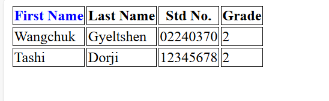

### Documentation 
- **Concepts Applied:**  
  - Used semantic tags like `<table>`, `<tr>`, `<th>`, and `<td>` to structure the table.
  - Implemented inline CSS to style specific table elements, such as the "First Name" header.
  - Added a `<style>` block for applying uniform borders to all table cells.
- **New Skills Acquired:**  
  - Styling individual HTML elements with inline CSS.  
  - Using `<style>` blocks to apply global styles to specific elements like `th` and `td`.

### Reflection 
- **What I Learned:**  
  - How to create a structured table in HTML with headers and data rows.
  - Styling individual table headers and data cells for better readability.
- **Challenges Faced:**  
  - Struggled with aligning table borders initially, which I resolved by adding the `border` property to both `th` and `td`.
  - Ensuring the header styles and table cell styles were visually distinct required tweaking the inline styles.

## Screenshots
