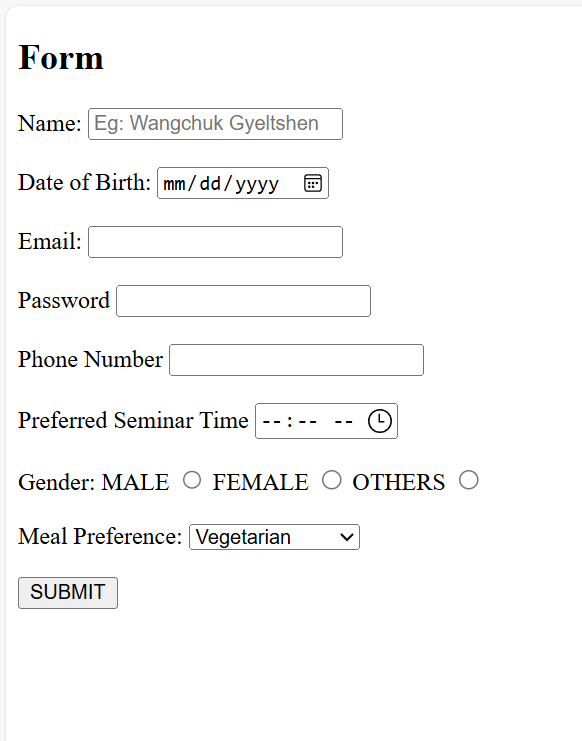

### Documentation 
- **Concepts Applied:**  
  - Created a user input form using semantic HTML tags such as `<form>`, `<input>`, `<label>`, and `<select>`.  
  - Used various `input` types (`text`, `date`, `email`, `number`, `time`, `radio`) to collect appropriate data.  
  - Included the `required` attribute to ensure necessary fields are completed before submission.

- **New Skills Acquired:**  
  - Gained experience in designing accessible forms with descriptive labels.  
  - Learned to use placeholders for user guidance and dropdown menus for limited-choice inputs.

### Reflection 
- **What I Learned:**  
  - The importance of selecting the right input type for data validation and user experience.  
  - How to organize form elements for clarity and usability.  

- **Challenges Faced:**  
  - Ensuring that all `label` elements were associated with their corresponding input fields. This was resolved by using the `for` attribute.  
  - Initially forgot to include the `required` attribute in some fields, which was corrected during testing.

### Screenshots
