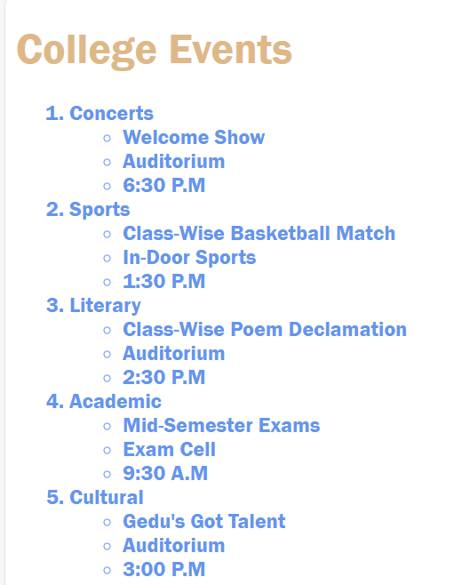

### Documentation 
- **Concepts Applied:**  
  - Used `<ol>` and `<ul>` to create a structured hierarchy for listing events and their details.  
  - Implemented a hover effect for interactivity using a CSS class.  
  - Applied color and font styles for better visual appeal and readability.

- **New Skills Acquired:**  
  - Learned to nest unordered lists within ordered lists for a hierarchical display of information.  
  - Experimented with CSS hover effects to add interactivity to the webpage.  

### Reflection 
- **What I Learned:**  
  - The importance of using the appropriate list type (`<ol>` vs. `<ul>`) for structuring content logically.  
  - How CSS hover effects can enhance user experience.  

- **Challenges Faced:**  
  - Initially had difficulty aligning nested lists properly due to incorrect nesting of `<ul>` elements, which was resolved by rechecking the list structure.  
  - Ensured uniform font styling across nested elements by explicitly setting font family in the CSS.

### Screenshots

