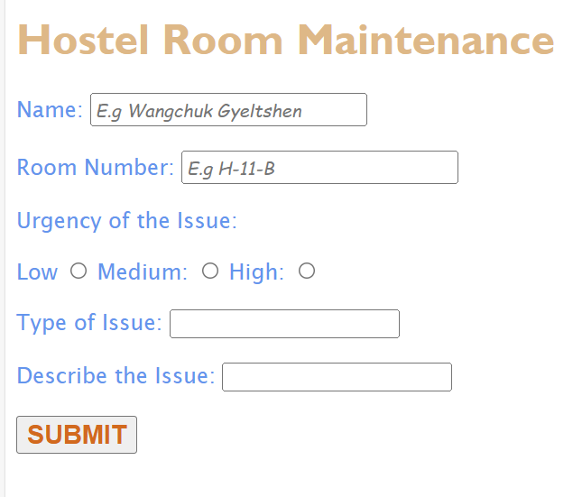

### Documentation 
- **Concepts Applied:**  
  - Used form elements like `<input>` for text, radio buttons, and a submit button.  
  - Styled headers, labels, and placeholders using CSS for better readability and user experience.  
  - Utilized radio buttons to allow users to select a single urgency level.

- **New Skills Acquired:**  
  - Learned how to customize placeholder text using CSS classes.  
  - Enhanced forms with consistent styling for headers, labels, and buttons.

### Reflection 
- **What I Learned:**  
  - The importance of designing intuitive forms with clear placeholders and labels.  
  - How to implement form field validation using the `required` attribute.

- **Challenges Faced:**  
  - Ensured alignment of radio buttons and labels by rechecking HTML structure.  
  - Styled the placeholders correctly while maintaining overall form aesthetics.

---

## Screenshots
### Screenshot of the Form:
 