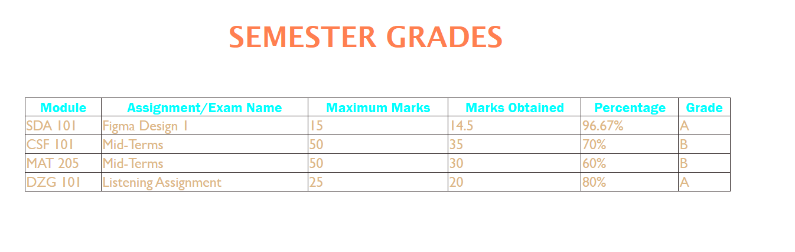

## Reflection.md

### Documentation 
- **Concepts Applied:**  
  - Created a comprehensive table using semantic HTML tags.  
  - Used CSS to apply styles for text color, font family, borders, and layout positioning.  
  - Incorporated percentages and grades for a real-world grading system example.

- **New Skills Acquired:**  
  - Improved understanding of table-specific CSS properties such as `border-collapse` and spacing.  
  - Learned to position elements using `margin` properties for better alignment.

### Reflection 
- **What I Learned:**  
  - How to create a clean and professional table for displaying tabular data.  
  - The importance of applying proper styling to improve data readability and visual appeal.

- **Challenges Faced:**  
  - Initial alignment issues were resolved by using `margin-left` to adjust the table position.  
  - Struggled with maintaining consistency in font styles, which was fixed by explicitly setting font families for `<th>` and `<td>`.

---

## Screenshots
### Screenshot of the Table:
