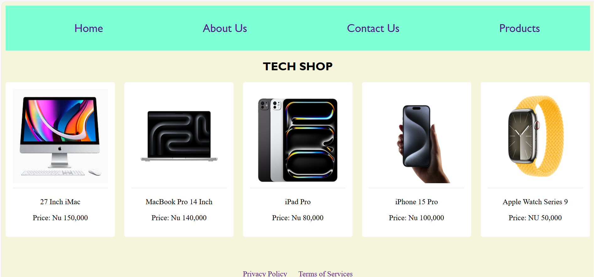

### Documentation 
- **Concepts Applied:**  
  - Used semantic HTML to structure the page and CSS for styling and layout.  
  - Leveraged flexbox and grid layouts for responsive design.  
  - Incorporated external libraries like Font Awesome for social media icons.  

- **New Skills Acquired:**  
  - Enhanced proficiency in CSS grid and flexbox layouts for modern web design.  
  - Gained experience in integrating and styling external resources like icons and fonts.  

### Reflection 
- **What I Learned:**  
  - The importance of semantic HTML in creating structured and accessible web pages.  
  - How to build responsive layouts using CSS grid and flexbox.  
  - Styling consistency across multiple sections to ensure a professional look.

- **Challenges Faced:**  
  - Ensuring proper alignment of grid items on different screen sizes, resolved by using `auto-fill` and `minmax` properties.  
  - Balancing the color scheme for better readability and aesthetic appeal, which required iterative adjustments.

---

## Screenshots
### Screenshot of the Landing Page:

