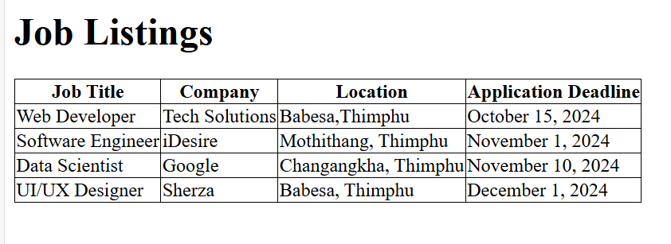

### Documentation 
- **Concepts Applied:**  
  - Structured tabular data using semantic HTML for accessibility and clarity.  
  - Used CSS to create hover effects and improve the table's interactivity.  
  - Implemented responsive design practices for better usability on smaller screens.  

- **New Skills Acquired:**  
  - Learned to apply `overflow-x-auto` for responsive scrolling.  
  - Improved understanding of designing visually engaging tables with a focus on user experience.

### Reflection 
- **What I Learned:**  
  - The importance of semantic table elements (`<thead>`, `<tbody>`) for clear and accessible data representation.  
  - How to integrate hover effects and row styling to enhance user interaction.  

- **Challenges Faced:**  
  - Initially had issues with aligning text consistently, resolved by applying padding to `<th>` and `<td>`.  
  - Ensured responsiveness by testing the table on various screen sizes and adjusting properties like `min-w-full`.  

---

## Screenshots
### Screenshot of the Job Listings Table:
 